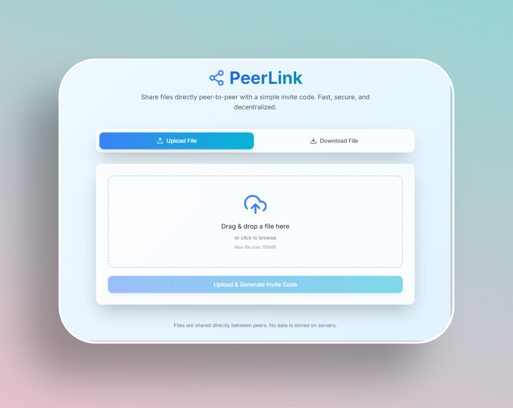
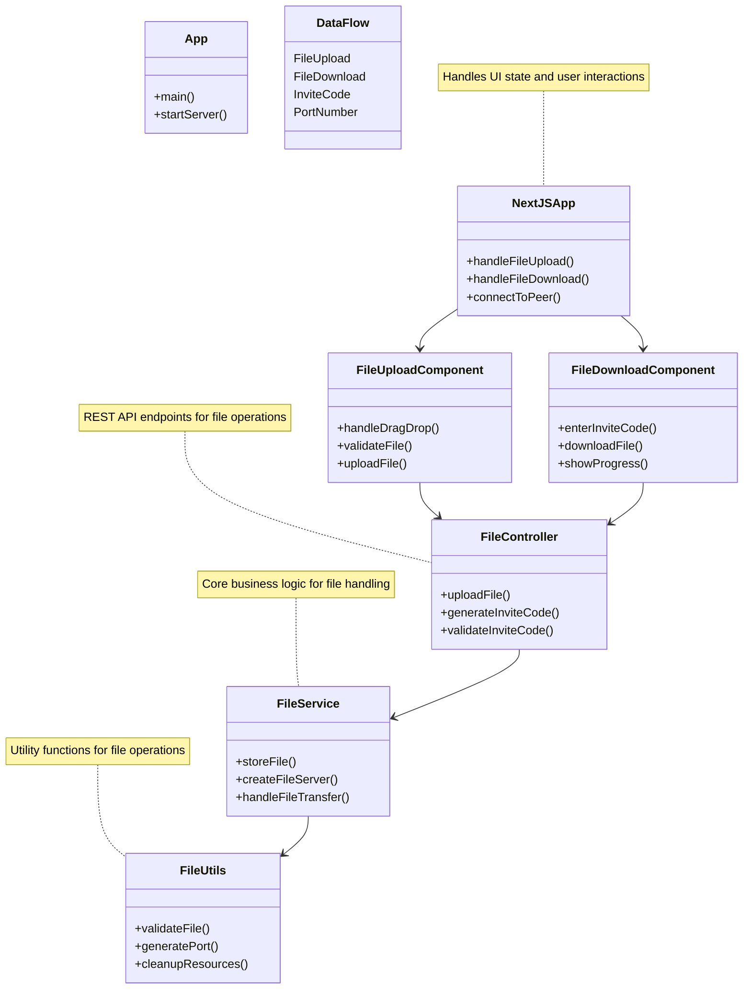

# PeerLink - P2P File Sharing Application

PeerLink is a peer-to-peer file sharing application that allows users to share files directly between devices using a simple invite code system.
### Drag and Drop File Upload
This feature allows users to quickly share files without traditional file explorers.



## Project Structure

- `src/main/java/p2p`: Java backend code
  - `App.java`: Main application entry point
  - `controller/`: API controllers
  - `service/`: Business logic services
  - `utils/`: Utility classes
- `ui/`: Next.js frontend application
  - `src/app`: Next.js app router pages
  - `src/components`: React components

## Features

- Drag and drop file upload
- File sharing via invite codes (port numbers)
- File downloading using invite codes
- Modern, responsive UI
- Direct peer-to-peer file transfer

## Prerequisites

- Java 11+ (for the backend)
- Node.js 18+ and npm (for the frontend)
- Maven (for building the Java project)

## Getting Started

### Quick Start

#### Linux/macOS:

```bash
./start.sh
```

#### Windows:

```cmd
start.bat
```

These scripts will build the Java backend, start the server, and launch the frontend development server.

### Manual Setup

#### Backend Setup

1. Build the Java project:

```bash
mvn clean package
```

2. Run the backend server:

```bash
java -jar target/p2p-1.0-SNAPSHOT.jar
```

The backend server will start on port 8080.

#### Frontend Setup

1. Install dependencies:

```bash
cd ui
npm install
```

2. Run the development server:

```bash
npm run dev
```

The frontend will be available at [http://localhost:3000](http://localhost:3000).

## How It Works

1. **File Upload:**
   - User uploads a file through the UI
   - The file is sent to the Java backend
   - The backend assigns a unique port number (invite code)
   - The backend starts a file server on that port

2. **File Sharing:**
   - The user shares the invite code with another user
   - The other user enters the invite code in their UI

3. **File Download:**
   - The UI connects to the specified port
   - The file is transferred directly from the host to the recipient

## Architecture

```
┌─────────────┐     ┌─────────────┐     ┌─────────────┐
│             │     │             │     │             │
│  Next.js UI │◄────►│ Java Server │◄────►│ Peer Device │
│             │     │             │     │             │
└─────────────┘     └─────────────┘     └─────────────┘
```

## Low Level Design (LLD)



### Component Details

**Frontend Components**
- `NextJSApp`: Main application component managing state and routing
- `FileUploadComponent`: Handles drag-and-drop file uploads
- `FileDownloadComponent`: Manages file downloads using invite codes

**Backend Components**
- `App`: Main application entry point and server initialization
- `FileController`: REST API endpoints for file operations
- `FileService`: Core business logic for file handling
- `FileUtils`: Utility functions for file validation and port management

**Data Flow**
- File uploads are handled through drag-and-drop
- Invite codes (port numbers) are generated for sharing
- Direct peer-to-peer file transfer using WebSocket connections

## Security Considerations

- Files are stored temporarily in the system's temp directory
- Each file gets a unique filename to prevent conflicts
- Port numbers are randomly generated in the dynamic port range (49152-65535)
- CORS is enabled for cross-origin requests

## Deployment

### Local Development
For local development and testing, use the startup scripts as described in the "Getting Started" section above.

### Production Deployment (AWS with Nginx)

PeerLink can be deployed to AWS EC2 with Nginx as a reverse proxy for production use.

#### Quick Deployment Steps

1. **Launch EC2 Instance**
   - Ubuntu 22.04 LTS
   - t3.medium or larger
   - Configure security group (see `deployment/SECURITY_GROUP.md`)
   - Allocate Elastic IP

2. **Upload Application**
   ```bash
   scp -i your-key.pem -r p2p ubuntu@your-ec2-ip:/home/ubuntu/peerlink
   ```

3. **Run Deployment Script**
   ```bash
   ssh -i your-key.pem ubuntu@your-ec2-ip
   cd /home/ubuntu/peerlink
   chmod +x deployment/deploy.sh
   ./deployment/deploy.sh
   ```

4. **Configure Domain & SSL**
   ```bash
   # Update Nginx config with your domain
   sudo nano /etc/nginx/sites-available/peerlink
   
   # Setup SSL certificate
   sudo certbot --nginx -d your-domain.com
   ```

#### Deployment Documentation

- **Comprehensive Guide**: See `deployment/README.md`
- **Deployment Checklist**: See `deployment/DEPLOYMENT_CHECKLIST.md`
- **Security Group Setup**: See `deployment/SECURITY_GROUP.md`
- **Full AWS Plan**: See `.gemini/antigravity/brain/.../aws_deployment_plan.md`

#### Cost Estimate
- Single EC2 instance (t3.medium): ~$40-80/month
- Includes compute, storage, and data transfer

#### Production Architecture
```
Internet → Nginx (443) → Next.js (3000) → Java Backend (8080)
                ↓
         P2P Ports (49152-65535)
```

For detailed deployment instructions, troubleshooting, and best practices, refer to the documentation in the `deployment/` directory.

## License

This project is open source and available under the MIT License.
